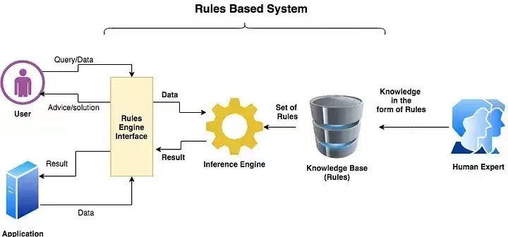

TMY 规则引擎介绍 { .text-center }
--------------

&nbsp;

### 聊天室与规则引擎

在本技术体系中，人与 AI 的交互媒介被统称为 “聊天室”，经典用法是用户向 AI 提问，然后 AI 答复，一问一答的交互方式被我们抽像的称作 “聊天” 模式。在逻辑上，我们通常认为每间聊天室都进驻一个机器人，用户切换不同的房间聊 天，意味着他转换与不同的机器人进行问答。

微信公众号 “填密语” 就是这种提供 AI 伺服的聊天室系统，当前聊天室主要对接 chatGPT 3.5，今后可能增设与其它 AI 系统的对接。

如果我们抽像看待 AI 服务，不妨将它视作一种 “基于规则的自动响应系统”，如下图。

推理引擎（Inference Engine）与知识库（Knowledge Base）合一起就是当前我们已经在用的大语言模型（LLM，如 chatGPT），我们并不将这两者用 LLM 一词替换，是因为它们是可替换的，某些时候，尤其是解决专业领域的问题时，我们不见得非得采用昂贵的 LLM 系统。

上图右侧是人类专家（Human Expert）为 AI 系统增强知识提供输入，以规则集的方式实施预训练，或进行微调训练。上图左侧描述人机交互以规则引擎（Rules Engine） 的方式实现对接，规则引擎还同时接入若干 Application 应用，为 chatGPT 提供的各类 plugins 均属于 Application。

规则引擎与用户（User）通过一问一答实现交互的接口层，就是我们通常意义上理解的 “聊天室” 。

&nbsp;

### TMY 规则引擎

填密语（TianMiYu，TMY）公众号是多聊天室 AI 问答系统，公众号里设置多个房间（room），不同房间提供不同主题的问答服务。除了一问一答正常聊天，每个 room 还允许定义若干触发词（magics），一个触发词对应一项动作，比如触发 room 配置更改，或称，调整 room 运行环境。

填密语中的聊天室由 TMY 规则引擎驱动，当前版本已支持为 chatGPT 类型的聊天室定义运行环境，非常适合让用户自行定制 prompt，实现更专业、更便利的问答服务。今后 TMY 规则引擎还将扩展如下功能：

- 分解任务
- 对拆解后子任务实施管理，跟踪执行过程、评估执行效果
- 为智能体赋予主体人格，强调目标性、有记忆力、具备自主推理能力
- 接入 plugins 系统，包括实时信息获取、特定动作输出、多智能体协作等

当前版本的规则引擎还只是一个 “图灵不完备” 的解释器，只支持表达式级别的编程，但对于定制 prompt 而言，已经够用了。

&nbsp;
