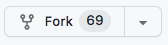
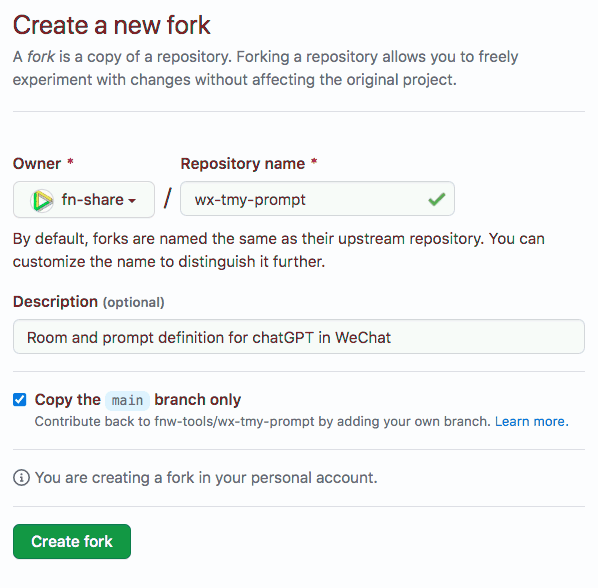
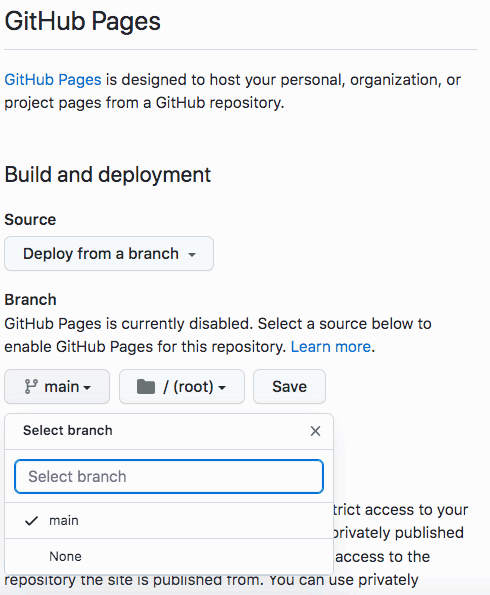
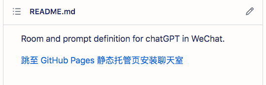

自定义聊天室 { .text-center }
-----------

&nbsp;

### 自定义聊天室的前提

用户需有一个对外可发布内容的站点，在站点上发布自行定制的聊天室，然后填密语公众号后台才能拉取定义并导入为可用聊天室。

我们建议用户在 github 创建一个 repo 来定制聊天室，一方面，github 中的 repo 可以很方便的配置成 Github Pages 静态托管站点；另一方面，我们为 github 静态托管填密语聊天室定义，额外做了封装，为聊天室二维码展示，单页面定义多个聊天室，以及调试聊天室等提供了一些便利。

接下来，我们详细讲解在 github 托管 TMY 聊天室定义的典型操作步骤。

&nbsp;

### 在 github 创建自己的聊天室定义

第 1 步：到 github 网站将样板项目 fork 到自己账号下

打开官方提供的 [样板聊天室 repo 主页](https://github.com/fnw-tools/wx-tmy-prompt) ，然后点击页面中的 fork 按钮，如下图：

然后系统自动打开如下页面：

给出 fork 后你自己的 repo 名称，然后点 “Create fork” 按钮。系统随即为你创建一个经复制而来的项目。

&nbsp;

第 2 步：为 fork 项目配置 Github Pages 静态网页托管

在 fork 来的项目主页，点右上角的 Settings 按钮，然后选左边栏的 Pages 选项，页面右侧将呈现如下界面。

选择要静态托管的分支（缺省应选 main 分支），然后点 Save 按钮。

&nbsp;

第 3 步：修改 room 定义

回到自己的项目主页，如下图，点击编辑按钮，随后在线修改 README.md 文件，聊天室在此文件中定义。

修改后点提交按钮，让修改生效。

因为在上一步我们配置了当前 repo 是静态托管的，修改生效后 README.md 随即会自动更新到 `github.io` 静态托管站。

点击上图中的 "跳至 GitHub Pages 静态托管页安装聊天室"，系统随后会打开静态托管站的主页，用户将发现自定义的聊天室有二维码呈现了。

&nbsp;

### 在 FNS Netlog 定义自己的聊天室

上述在 github 托管 TMY 聊天室定义比较好用，除了修改并提交 README.md 文件后，更新到 `github.io` 托管站稍有滞后，从等数秒到等数分钟，时长不确定，Github Pages 官方说这种滞后最长要等 10 分钟。这对聊天室调试时频繁修改、频繁试用，不够友好。

为调试方便，用户不妨改用 [FNS Netlog](https://netlog.fn-share.com) 软件，在网志中编辑聊天室定义，同样用 `"ADD_ROOM <netlog_publish_url>"` 在填密语的 GPT 房间发送指令来添加新定义的聊天室。在 FNS Netlog 编辑内容支持即时发布，注意，请从 "主菜单 | 设置" 进入配置页，要把 “自动发布” 的选项勾选上。
